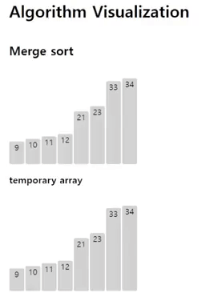
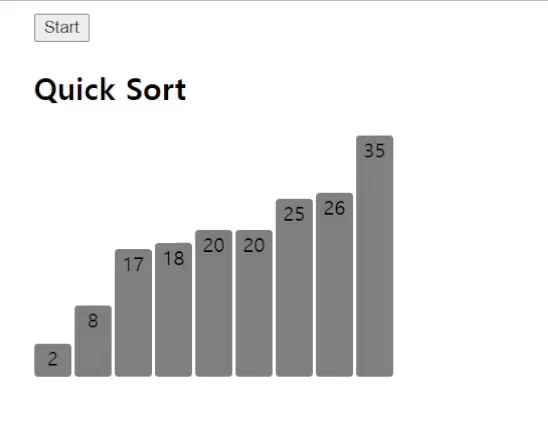

# Algorithm visualization

3rd year 1st sem.

Visualize various algorithms with vanilla Javascript.

## Algorithms

### [Divide and quanquer](divide_and_conquer)

- [Merge sort](divide_and_conquer/merge_sort)

  

- [Quick sort](divide_and_conquer/quick_sort)

  
